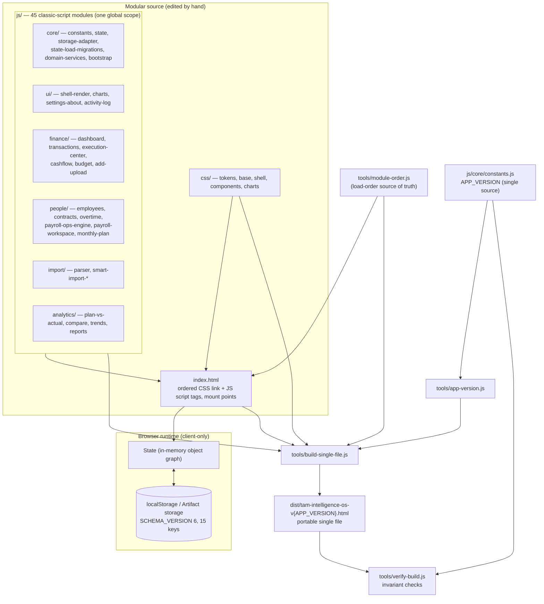
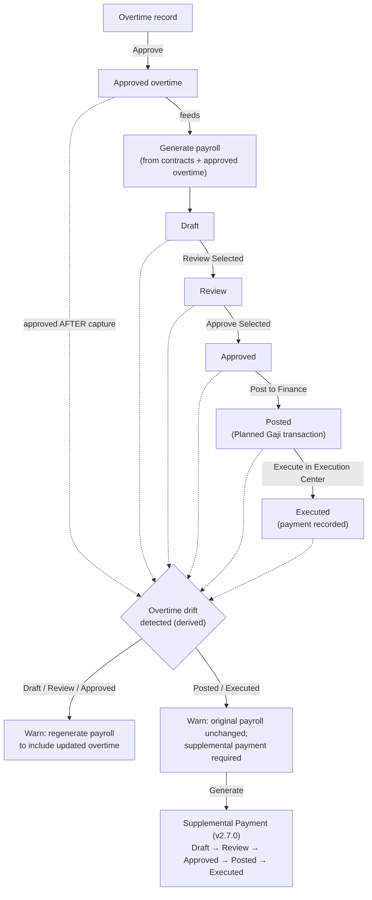
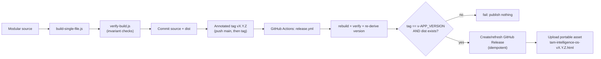

# TAM Intelligence OS — Architecture

**Current release:** v2.7.0 — Supplemental Payroll Engine
**Basis:** `tam-intelligence-os-v2.5.2.html` (frozen golden-master source of truth for the
CSS/data-safety invariants)
**Shape today:** a modular source of **45 classic-script JS modules** (in `core/ ui/ finance/
people/ import/ analytics/`) + 5 CSS files, assembled into one portable
`dist/tam-intelligence-os-v${APP_VERSION}.html`. Still one shared global scope — no ES modules,
no bundler. `SCHEMA_VERSION` is 6.

> **How to read this document.** Sections 1 and 3–6 describe the founding **Phase 0** split
> (v2.6.0) and are preserved as historical provenance — the line ranges are the authority for
> how the original cut was derived. Section 2 is the original 20-file map (historical). The
> project as it stands today is described by the release sections: **§8** (v2.6.1 incremental
> render), **§9** (v2.6.2 decomposition into the feature-folder tree — the current 44-module
> layout), **§10** (v2.6.3 Payroll workspace), **§11** (v2.6.4 release automation + audit
> visibility), **§12** (v2.6.5 Smart Import scroll preservation), **§13** (v2.6.6 company
> settings checklist fix), **§14** (v2.6.7 repository governance & delivery — no runtime
> change), **§15** (v2.6.8 generic payroll bulk-selection model + immediate overtime-drift
> visibility), **§16** (v2.6.9 Enterprise Banking Foundation — Bank Master, Company Bank
> Accounts, employee banking) and **§17** (v2.7.0 Supplemental Payroll Engine). Where an early
> section says "20 files", read §9 for the current structure.

---

## Diagrams

These diagrams reflect the actual implementation. There is **no server, database, API, or external
service** — the app is client-only; Node is used solely for the build/verify tooling.

### A. Application structure



### B. Payroll workflow (and overtime drift)



Stages are a display mapping over the stored status values (`Draft` / `Reviewed` / `Ready` /
`Committed`), with `Executed` derived from the linked finance transaction — no schema change. Drift
is a **derived**, read-only comparison (`payrollOvertimeDrift`) reusing `approvedOvertimeForMonth` +
`sameIdSet`; Posted/Executed totals and transactions are never modified.

### C. Release pipeline



CI (`ci.yml`) runs build + verify on every push/PR to `main` and uploads the portable HTML as an
artifact. The release job publishes nothing unless every guardrail passes.

---

## 17. v2.7.0 — Supplemental Payroll Engine (one additive storage key; SCHEMA 6)

A **separate accounting document** that settles overtime approved after the base payroll became
immutable (Posted/Executed). The base payroll total, its finance transaction, and its execution
history are **never** modified. New module `js/people/supplemental-engine.js` (engine + UI, loaded
after `payroll-workspace.js`) and store `tam_supplemental_payments_v1` (the **15th** key).

- **Source (v1): overtime only.** The amount reuses the existing `payrollOvertimeDrift(pp)` per-ID
  basis via `supplementalAmountForIds` — no second overtime-delta formula.
- **Centralized rules** (not in UI handlers): `supplementalEligibleOvertime` (drift minus overtime
  already captured by non-cancelled supplementals — the duplicate-prevention core),
  `openSupplementalForPlan` (at most one open Draft/Review per plan/source), `generateSupplementalForPlan`
  (explicit, idempotent), `refreshSupplemental` (explicit, audited; open records only),
  `canTransitionSupplemental` / `transitionSupplemental`, `postSupplemental`, `linkSupplementalExecution`.
- **Lifecycle** Draft → Review → Approved → Posted → Executed (+ Cancelled). Amount and source
  overtime **freeze at Approved**; later overtime forms a **new** supplemental rather than mutating a
  frozen one.
- **Finance/Execution reuse:** posting creates exactly one Planned transaction (`source:'supplemental'`,
  `supplementalId` link both ways, immutable company-account snapshot); `executeTransaction` calls
  `linkSupplementalExecution`, which closes the supplemental (idempotent) — the base payroll and its
  execution are untouched.
- **Data safety:** additive store (empty default, **no seed** — fresh installs start empty); backup /
  restore include `supplementalPayments`; `SCHEMA_VERSION` unchanged (6); verifier known-key count
  **14 → 15**.
- **Housekeeping shipped alongside:** a centralized `FEATURE_REGISTRY` + `featureBadgeHTML` replace the
  hardcoded sidebar badge (Projects/Vendors/Financial Calendar → SOON; Recurring Expenses stable);
  the general employee CSV export masks account numbers; CI/Release "Verify build" labels are
  count-neutral.

---

## 16. v2.6.9 — Enterprise Banking Foundation (one additive storage key; SCHEMA 6)

Adds structured banking without touching payroll/finance calculations or committed data. Files:
`js/core/constants.js` (Bank Master + account enums), `js/core/utils.js` (`maskAccountNumber`),
`js/core/domain-services.js` (company-account helpers + dropdown options), `js/core/hr-persistence-portability.js`
(new store + backup/restore + guarded seed), `js/core/state-load-migrations.js` (seed wired into
init), `js/ui/settings-about.js` (Bank Accounts page + modal), `js/ui/shell-render.js` (nav +
dispatch), `js/ui/activity-log.js` (audit labels), `js/people/employees.js` (bank from master +
Account Holder), and the transaction/recurring dropdowns.

- **Indonesian Bank Master** is a constant (`BANK_MASTER_GROUPS` / `INDONESIAN_BANKS`) — grouped,
  alphabetized, single source of truth. **No storage key**; reference data only.
- **Company Bank Accounts** are a new persistent store `tam_company_accounts_v1` (the **14th** key;
  the 13 legacy keys are unchanged). Model: `{ id, label, bankName, holder, accountNumber, purpose,
  status }`. Account numbers are **masked** in all lists (`maskAccountNumber`, last 4 only); the full
  value appears only in the edit field. Only **Active** accounts feed transaction/payroll dropdowns,
  displayed as "Label — Bank". The stored transaction value remains the account **label string**, so
  legacy `bankAccount` strings keep resolving.
- **Employee banking** selects its bank from the master (legacy short names mapped, unknown values
  preserved) and gains an Account Holder field; `bankAccountNumber` and the legacy `bankAccount` are
  kept in sync on save.
- **Backward compatibility:** a one-time, guarded, non-destructive seed (`tam_migrated_bankaccts_v269`)
  converts the five legacy bank strings into Active company accounts **only on installs that already
  have data** — a fresh install stays empty (the empty-seed invariant holds). Complete Backup /
  Restore include `companyAccounts`; older backups without it restore cleanly.
- **`SCHEMA_VERSION` is unchanged (6)** — the new store is additive with an empty default; no existing
  data is transformed. The verifier's known-key count moves **13 → 14** and gains checks for the new
  key, the seed flag, and that the Bank Master is a constant (114 checks total).
- **Supplemental Payment is out of scope** here (planned for v2.7.0); the v2.6.8 overtime-drift
  warning and its disabled placeholder are unchanged.

---

## 1. Design principle: preserve the shared global scope (Phase 0, still in force)

The stable app is one `<script>` in one global function scope. Templates reference
functions by bare name, delegated event handlers call globals, and top-level `const`
initializations (`State`, `PAGE_TITLES`, `PLACEHOLDER_IDS`, `TAM_DATA_KEYS`, …) depend on
earlier declarations. Converting to ES modules now would require rewiring hundreds of
cross-references — high risk, zero user benefit.

**Phase 0 therefore keeps the exact global scope.** The JavaScript is split into
**contiguous slices in original order** and loaded as **classic `<script src>` tags** (no
`type="module"`, no `import`, no `export`). Classic scripts on a page share one global
lexical + object scope, so `const State` in `js/04-state.js` is visible to
`js/12-people-pages.js` exactly as before. Concatenating the files in order reproduces the
original script body byte-for-byte (except three intentional version edits).

Because each file is loaded as an independent classic script, **every cut lands on a
top-level boundary** (between complete declarations) so each file parses on its own.

---

## 2. JavaScript modules — the original Phase 0 split (20 files) — *historical*

> **Historical (v2.6.0).** This is the original 20-file cut. In v2.6.2 these files were
> decomposed into the current 44-module feature-folder tree (see **§9**), and v2.6.4 added one
> more module (`ui/activity-log.js`). This table is retained because its line ranges are the
> provenance for how the source was first derived from the golden master.

Each file is a verbatim, contiguous slice of `tam-intelligence-os-v2.5.2.html`. The line
ranges are the provenance; they are the authority for how the split was derived.

| # | File | v2.5.2 lines | Contents |
|---|---|---|---|
| 00 | `00-constants.js` | 327–462 | Section map, app identity (`APP_*`, `SCHEMA_VERSION=6`), STATUS / employment / contract / plan / overtime meta maps, `computeStatus`/`statusOf`/`statusBadge`, month & category dictionaries |
| 01 | `01-utils.js` | 463–525 | `uid`, `fmtIDR*`, `escapeHtml`, `normStr`, date/key helpers, `toast`/`showSuccess`/`showWarning`/`showError`/`confirmAction`, `levenshtein`/`similarText` |
| 02 | `02-storage-adapter.js` | 526–634 | **Atomic:** `StorageAdapter` (claude/local gateway) + `safeParse` |
| 03 | `03-chart-engine.js` | 635–998 | Self-contained SVG chart engine (`drawLineChart`, `drawBarChart`, shell, tooltip, legend) |
| 04 | `04-state.js` | 999–1090 | **Atomic:** `DEFAULT_SETTINGS` + `State` singleton shape |
| 05 | `05-state-load-migrations.js` | 1091–1205 | `loadState` orchestration, `migrateToExecutionSchema`, `loadSettings`/`saveSettings`/`persist` |
| 06 | `06-domain-services.js` | 1206–1336 | Derived business logic: `getMonths`, `monthTotals`, `categoryBreakdown`, `execStats`, `recurringItems`, `computeInsights` |
| 07 | `07-import-parser.js` | 1337–1766 | Excel/CSV parsers, letter-doc + generic table parsing, column mapping, `parseUploadedFile` (XLSX), `detectDuplicates` |
| 08 | `08-ui-shell-render.js` | 1767–1932 | `NAV_GROUPS`, `render()`, `renderView()` dispatcher, sidebar scroll, placeholder pages, `monthSelectHTML` |
| 09 | `09-finance-pages.js` | 1933–2918 | Dashboard, Execution Center, Transactions, Add/Upload, execution-engine actions, execute/edit/detail modals, backup panel |
| 10 | `10-hr-persistence-portability.js` | 2919–3147 | `HR_KEYS`, `loadHRData`/`persistHR`, HR/overtime/payroll-ops/dedup migrations, **atomic:** complete backup / validate / restore |
| 11 | `11-import-ui-analytics.js` | 3148–4727 | `handleFile`, import preview + update-diff UI, Planned vs Actual, Compare, Trends, Executive Dashboard, Cash Flow, Budget Center, Settings, About, **Release Notes**, Reports |
| 12 | `12-people-pages.js` | 4728–6224 | People & Contracts engine: `contractCalc`, employees, contracts, payroll planning, recurring, monthly plan generator, legacy mapping, HR dashboard integration (**atomic:** payroll calc helpers) |
| 13 | `13-stabilization.js` | 6225–6627 | `saveAllData`, `migrateNormalizeEntities`, validators, `runIntegrityCheck`, a11y helpers, theme (`applyTheme`/`themeVar`) |
| 14 | `14-overtime.js` | 6628–7019 | Overtime engine: `overtimeCalc`, records CRUD, `renderOvertime`, worksheet |
| 15 | `15-onboarding-reset.js` | 7020–7216 | Onboarding checklist, empty states, `startFresh`/reset, demo data, dashboard OT/payroll strips |
| 16 | `16-smart-import.js` | 7217–7349 | Smart Import extraction + matching (`buildSmartImport`, `smartMatchEmployee/Contract`) |
| 17 | `17-employee-dedup.js` | 7350–7935 | **Atomic:** employee dedup + merge engine, Smart Import commit/undo, dedup review UI, import results |
| 18 | `18-payroll-ops.js` | 7936–8518 | Native Payroll Operations engine + Payroll Workspace UI (worksheet, commit, adjustments, salary override) |
| 19 | `19-app-bootstrap.js` | 8519–8528 | The `init()` IIFE: `loadState → applyTheme → installGlobalUIHandlers → render → maybeShowFirstRunChoice` |

**Load order == declaration order == original file order.** This is required: top-level
`const` initializations and the `loadState` migration-call ordering must run in the same
sequence as v2.5.2.

---

## 3. CSS modules (5 files, cascade order preserved)

Contiguous slices of the original inline `<style>` (v2.5.2 lines 12–304). Load order is
fixed and must not change (later files rely on tokens; the cascade is order-sensitive).

| Order | File | v2.5.2 lines | Contents |
|---|---|---|---|
| 1 | `tokens.css` | 13–68 | `:root` theme variables (dark + light) — must load first |
| 2 | `base.css` | 69–88 | Reset, `body`, scrollbar, selection, light-theme pill/toast overrides |
| 3 | `shell.css` | 89–155 | Sidebar, nav groups, brand, responsive shell |
| 4 | `components.css` | 156–287 | Cards/grid, tables, forms, dropzone, tabs, pills, badges, empty states, toast, modal, KPI chips |
| 5 | `charts.css` | 288–303 | `.chart-*` styles (plus trailing `.month-strip` / `textarea.input`, kept here to preserve exact source order) |

---

## 4. index.html (entry)

Minimal shell, reusing the original outer template verbatim (only the `<title>` is bumped
to v2.6.0):

- `<head>`: charset/viewport/title/theme-color, Google Fonts, **external XLSX 0.18.5 CDN**,
  then the five CSS `<link>`s in order.
- Pre-paint theme boot script (verbatim from v2.5.2) — runs before first paint to prevent
  a theme flash; reads `tam_settings_v1` from `localStorage`.
- Mount points `#app`, `#toast-root`, `#modal-root`.
- Empty seed data: `<script id="seed-data" type="application/json">[]</script>`.
- The twenty JS `<script src>` tags, in order, at end of `<body>` (matching where the
  original single script lived).

---

## 5. Atomic groups (never split — per the architecture review)

Kept whole inside a single file:

- `StorageAdapter` + `safeParse` → `02`
- `DEFAULT_SETTINGS` + `State` shape → `04`
- `loadState` + migration-call ordering → `05` (the ordering lives in `loadState`; the
  individual migration function definitions are hoisted and may sit in `05`/`10`/`13`
  without changing the call sequence)
- Complete backup / validate / restore → `10`
- Storage-key registry (`HR_KEYS`) + `SCHEMA_VERSION` → `10` / `00`
- Employee merge engine → `17`
- Payroll calculation helpers → `12` (legacy) and `18` (native ops)

---

## 6. Build & golden master

- **Build** (`tools/build-single-file.*`): inline the 5 CSS into one `<style>` and the 20
  JS into one `<script>`, in order → `dist/tam-intelligence-os-v2.6.0.html`. No minify.
- **Golden master** (`tools/verify-build.*`): the dist `<style>` payload must equal v2.5.2
  CSS byte-for-byte, and the dist main `<script>` payload must equal v2.5.2 JS with **only**
  the three intentional edits — any other difference fails the build. Additional invariant
  checks cover storage keys, migration flags, `SCHEMA_VERSION==6`, empty seed data, mount
  points, single `init()`, and absence of ES module syntax.

### The only intentional changes in v2.6.0

1. `APP_VERSION` `'2.5.2'` → `'2.6.0'` (propagates to `FILE_BASE`, About, Diagnostics,
   report headers, and every export filename).
2. `APP_RELEASE_NAME` → `'Modular Frontend Architecture'`.
3. One additive **Release Notes** entry for 2.6.0 (no historical entry altered).
4. `<title>` → `TAM Intelligence OS v2.6.0` (index.html + dist).

Everything else — including every `v2.5.2`/`v252` string inside migration flags
(`tam_migrated_dedup_v252`), pre-migration backup labels, and historical comments/notes —
is **unchanged**, because those are storage keys and history, not version identity.

---

## 7. Roadmap (NOT in Phase 0)

Deliberately deferred to later phases:

- **Phase 1:** true ES module boundaries (`import`/`export`) for the pure leaves
  (constants, utils, notifications, StorageAdapter, charts, validators) once a bundler
  (esbuild → IIFE) and the golden master are wired to catch dead-code elimination of
  string-referenced functions.
- **Phase 2+:** extract the data core atomically, then services/import, then UI
  infrastructure (resolving the `router ↔ pages` cycle), then the business page modules.
- **Later:** de-duplicate CSV export / modal scaffolding / table rendering (the review
  estimated ~3–8% reclaimable) — intentionally **not** done now to protect behavior.

---

## 8. v2.6.1 — Incremental list rendering (Search Focus fix)

The first behavioral change after the split. Previously every search box called its full
page renderer on each `input` event (`renderEmployees(main)`, etc.), rebuilding
`main.innerHTML` — which destroyed and recreated the `<input>`, so focus, caret, and
selection were lost on every keystroke. (This bug pre-existed in v2.5.2; the split did not
introduce it.)

**Pattern applied to each list page** (Employees, Contracts, Transactions, Payroll
worksheet, Overtime):

- `xFiltered()` — pure filter+sort of `State` → array (shared by rows, summaries, export).
- `xRowsHTML()` / `xBodyHTML()` — array → `<tbody>` markup (incl. empty-state row).
- `bindXRows()` — (re)binds only row-level handlers (action menus, inline edits, selection
  checkboxes). Safe to re-run after a `<tbody>` swap: `bindActionMenus`/`bindHRActions` add
  their document-level outside-click closer only on menu-open, never at bind time, so no
  listener accumulates; old row nodes are GC'd on `innerHTML` replacement.
- `applyXFilter(...)` — swaps only `#xRows`, updates filter-dependent summaries in place
  (`#txnCount`, Overtime `#otStat*`), and calls `bindXRows`. The page shell, toolbar, and
  search/filter inputs are never rebuilt.

Search `input` and filter `change` handlers now call `applyXFilter` instead of the full
renderer. The `<input>` element is never replaced, so focus/caret/selection persist
natively; the `.table-wrap` scroll container is untouched; and payroll selection survives
because it lives in `State.payrollSel` and is re-applied from `sel.has(id)` when rows
rebuild. No calculations, storage, or CSS changed — see `tools/verify-build.*`.

---

## 9. v2.6.2 — Module decomposition (feature-folder tree)

The 20 flat `js/NN-*.js` files were split into **43 modules** grouped by feature. This is a
**pure line-move**: `tools/decompose.js` sliced each file at top-level boundaries and
asserted that the concatenation of the new files (in load order) is **byte-identical** to
the old concatenation before writing anything. Runtime behavior is therefore unchanged.

Still classic ordered `<script>` tags, one shared global scope — no ES modules, no
`import`/`export`, no bundler. **Load order is behavior-critical** (top-level `const`
initializations depend on it) and lives in exactly one place: `tools/module-order.js`.
`index.html` mirrors it as `<script src>` tags; `build-single-file.js`/`verify-build.js`
`require()` it; `verify-build.js` asserts `index.html` matches the manifest.

```
js/
  core/        constants, utils, storage-adapter, state, state-load-migrations,
               domain-services, hr-persistence-portability, stabilization,
               onboarding-reset, app-bootstrap
  ui/          charts, shell-render, settings-about
  finance/     dashboard, execution-center, transaction-modals, transactions,
               add-upload, cashflow, budget
  people/      people-core, employees, contracts, payroll-planning,
               recurring-expenses, monthly-plan, legacy-mapping,
               hr-dashboard-reports, overtime, employee-dedup,
               payroll-ops-engine, payroll-workspace
  import/      parser, import-preview, smart-import-extract,
               smart-import-commit, smart-import-ui
  analytics/   plan-vs-actual, compare, trends, executive-dashboard,
               executive-insights, reports
```

Folders are organizational only — a file's position in the **load order** is set by the
manifest, not its folder, so a `finance/` file (e.g. `cashflow.js`) may load in the middle
of the `analytics/` group where its code originally sat. That ordering is deliberate and
must not be "tidied" without re-verifying the byte-identical concatenation.

Provenance (old flat file → new modules):

| Old file | New modules |
|---|---|
| `09-finance-pages.js` | `finance/dashboard, execution-center, transaction-modals, transactions, add-upload` |
| `11-import-ui-analytics.js` | `import/import-preview` · `analytics/plan-vs-actual, compare, trends, executive-dashboard, executive-insights, reports` · `finance/cashflow, budget` · `ui/settings-about` |
| `12-people-pages.js` | `people/people-core, employees, contracts, payroll-planning, recurring-expenses, monthly-plan, legacy-mapping, hr-dashboard-reports` |
| `17-employee-dedup.js` | `import/smart-import-commit, smart-import-ui` · `people/employee-dedup` |
| `18-payroll-ops.js` | `people/payroll-ops-engine, payroll-workspace` |
| all others (00–08,10,13–16,19) | moved 1:1 into `core/`, `ui/`, `import/` |

Average module size dropped from ~410 to ~190 lines; the largest is now ~350 (was 1,581).

---

## 10. v2.6.3 — Payroll Intelligence Workspace

Payroll is an **operational workspace**, not a CRUD spreadsheet. Two modules carry it:

- `people/payroll-ops-engine.js` — data + rules: generation (duplicate-safe), review
  lifecycle, commit/post, and the v2.6.3 additions: `payrollStage`/`payrollStagePill`/
  `payrollStageCounts`, `payrollSummary`, `payrollHealth`, and the period lock
  (`isPayrollLocked`/`setPayrollLock`).
- `people/payroll-workspace.js` — the UI: `renderPayrollWorkspace` (period banner, KPI cards,
  health, summary), the read-only `renderPayrollWorksheet` (incremental search preserved), and
  `renderPayrollDetail` (read-only preview).

**Lifecycle = display mapping, not new data.** Stored `pp.status` stays
`Draft/Reviewed/Ready/Committed/Cancelled` (unchanged — no migration). `payrollStage(pp)` maps
them to **Draft → Review → Approved → Posted**, and derives **Executed** from the linked
transaction's status. So the operational vocabulary is presentation-only.

**Single source of truth.** Payroll = Base Salary + Approved Overtime. Salary comes from the
Contract, overtime from Approved overtime records; both flow into the read-only Total
(`computePayrollPlanned`, untouched). The worksheet edits nothing — it removed the
allowance/bonus/benefits/deduction columns. Posting (`commitReadyPayroll`) creates **Planned**
finance transactions and flips their approved overtime to "Committed to Payroll"; execution
stays in the Execution Center.

**Period lock** persists in `State.settings.payrollLocks` (`{monthKey: true}`) — an additive
field on the existing `tam_settings_v1` key, so **no new storage key and no SCHEMA_VERSION
change**. Guards live at the mutation chokepoints: `setPayrollStatus`, `bulkPayrollStatus`,
`commitReadyPayroll`, and the overtime mutators (`add/update/setStatus/duplicate/delete/
worksheetSave`) all refuse when the target month is locked.

**Health** (`payrollHealth`) is deterministic — contract-expiry, ±20% period-over-period,
high-overtime, and missing-contract rules — no AI, no external calls.

---

## 12. v2.6.5 — Smart Import selection scroll preservation

A targeted UX fix in `js/import/smart-import-ui.js`. No change to parsing, matching, payroll
generation, transaction creation, duplicate prevention, storage, `SCHEMA_VERSION`, audit or CSS.

**Root cause.** Every review checkbox `change` called `renderSmartImport(main)`, which does
`main.innerHTML = …`. That rebuilds the review `.table-wrap` (a `max-height:520px; overflow:auto`
scroller), so its `scrollTop` reset to 0 and the list jumped to the top on every toggle.

**Key insight.** `smartCounts(model)` derives every stat card and tab count from `actions.*`,
`reviewRequired` and match status — **never from `item.selected`**. So toggling a row's selection
changes nothing on screen except that row's own checkbox (already toggled natively by the click).
A re-render was pure waste.

**Fix, by control:**

- **Row selection** (`[data-sisel]` change) — fully incremental: set `model.items[idx].selected`
  and call `updateSmartSelectionCount(model)` (updates only the new live "N selected" indicator).
  No re-render → the scroll container is never rebuilt → scroll position and keyboard focus are
  preserved natively.
- **Select All Safe / Unselect All** — also incremental: flip `selected` on the model, then
  `syncSmartCheckboxes(main, model)` sets each visible checkbox's `checked`/`disabled` in place.
  No re-render.
- **Skip Conflicts** and **column-mapping override** — these change `actions.skip` (moving rows
  between buckets, changing counts and disabled state) or rebuild the whole model, so a re-render
  is genuinely required. They run inside `preserveSmartImportView(main, mutate)`, which captures
  the `.table-wrap` `scrollTop`/`scrollLeft`, the `window` scroll, and the focused control's
  identity (`data-sisel`/`data-simap`/`data-sitab`); runs the mutation/render; then restores scroll
  and focus. Restoration is scheduled on **both** `requestAnimationFrame` (primary; matches the
  sidebar-scroll pattern) and a guarded `setTimeout` backstop (so it still runs when the tab is
  hidden and rAF is paused), runs once (a `done` flag), forces a reflow (`void scrollHeight`) so the
  `scrollTop` assignment sticks, and calls `focus({preventScroll:true})` so nothing is scrolled
  into view.
- **Review tab switch** is intentional navigation and is left to start the new tab at the top.

Selection state and the visible checkbox set continue to survive tab switches because selection
lives in `model.items[].selected` and every render reads it back.

---

## 13. v2.6.6 — Company settings checklist fix

A one-line-of-logic fix in `js/core/onboarding-reset.js`. No storage, schema, calculation or CSS
change; no company data is reset or modified.

**Bug.** The onboarding "Configure company settings" step used
`State.settings.companyName !== COMPANY_NAME_DEFAULT || State.settings.openingCashBalance != null`.
It ignored the **Product Name** field entirely and treated the shipped default company name as
"not configured", so a user who saved Settings while keeping the default company name (which is
the real company's name) and without entering an opening cash balance never saw the step check —
even after saving.

**Fix.** Completion is derived from persisted settings via a small pure helper:

```js
function companySettingsConfigured(s){
  s = s || State.settings || {};
  const name = (s.companyName||'').trim();
  const product = (s.productName||'').trim();
  return (!!name && name !== COMPANY_NAME_DEFAULT)   // intentional, non-default company name
      || (!!product && product !== APP_NAME)         // intentional, non-default product name
      || (s.openingCashBalance != null);             // opening cash balance supplied
}
```

- **Derived, persisted, reload-safe.** It reads only `tam_settings_v1` fields, so the state is
  correct immediately after `saveSettings()` and after navigation/reload — no transient UI flag.
- **Meaningful change, not just any save.** Unchanged shipped defaults return `false` (a fresh
  install stays "not configured"), and a theme-only save leaves the identity at defaults so it
  also returns `false` — Appearance is not a company-identity field. Any one of the three
  identity signals is enough, so optional blank fields never block completion.
- **Refresh without reload.** The Settings form's submit handler already calls `render()` after
  `saveSettings()`, so the dashboard checklist recomputes from the new persisted settings the
  next time it renders — no browser reload required.

---

## 14. v2.6.7 — Repository governance & delivery (no runtime change)

An **engineering/governance** release. The application runtime is byte-identical to v2.6.6 apart
from the version identity (`APP_VERSION` 2.6.7, `APP_RELEASE_NAME`, the `<title>`, the additive
Release Notes entry, and the regenerated dist). No `SCHEMA_VERSION`, storage key, migration flag,
calculation, backup format, module load order, or `.css` change.

**Delivery automation** (both derive the version from `constants.js` via `tools/app-version.js`,
matching the local tooling — a single source of truth):

- `.github/workflows/ci.yml` — on push / PR to `main` and on demand: `build-single-file.js` →
  `verify-build.js` (109 checks) → confirm the version-derived dist exists → upload it as an
  artifact. No `npm install` (the app has no dependencies).
- `.github/workflows/release.yml` — on `v*` tags: rebuild, verify, re-derive the version, and
  **refuse to publish unless the tag equals `v<APP_VERSION>`** and the portable HTML exists; then
  create/refresh the GitHub Release idempotently and upload the asset.

**Governance & docs** (non-runtime files): issue templates + `config.yml`, `pull_request_template.md`,
`CODEOWNERS` (@fanoryu), `SECURITY.md`, `CONTRIBUTING.md`, `CODE_OF_CONDUCT.md`, `PROPRIETARY-LICENSE-NOTICE.md`
(proprietary), `.github/RELEASE_TEMPLATE.md`, `RELEASE_NOTES.md`, and `docs/{QA-CHECKLIST,
RELEASE-PROCESS,DATA-SAFETY}.md`. Hardened `.gitignore`/`.gitattributes` (secrets, `.env`, local
backups, uploaded evidence, real workbooks kept out of version control; a sample-data policy allows
only fabricated samples under `samples/`). README gains CI/release/version/proprietary badges.

These files live **outside** the module load order and the build inlining, so `verify-build.js`
(build fidelity, CSS golden master, decomposition, `index.html` ↔ `module-order.js`) is unaffected.

---

## 15. v2.6.8 — Payroll selection & overtime drift UX (no schema/CSS/calculation change)

Two targeted UX/correctness fixes in `js/people/payroll-workspace.js` and
`js/people/payroll-ops-engine.js` (plus one banner call in `js/people/overtime.js`). The runtime
identity changes to `APP_VERSION` 2.6.8 / `APP_RELEASE_NAME` "Payroll Selection and Overtime Drift
UX Fixes". No `SCHEMA_VERSION` (still 6), storage key, migration flag, backup format, module load
order, or `.css` change; payroll status rules and committed-payroll immutability are unchanged.

**Generic bulk-selection model (Issue 1).** The payroll selection set is now stage-agnostic — it
simply holds the rows the user picked. Each bulk action declares its own eligible stages in one
registry, `PAYROLL_BULK_ACTIONS` (`review` → Draft; `approve` → Draft/Review; `post` → Approved),
and `partitionPayrollSelection(ids, action)` splits a selection into `{eligible, skipped}` with a
per-row reason (`payrollActionSkipReason`). Select All / the header checkbox select **all** visible
rows; the selected count is the actual number selected; each action auto-disables when the period
has no row eligible for **that** action and reports eligible / skipped / reason on run. Adding a
future action (Export, Delete, …) means adding one registry entry — the selection model does not
change. Post to Finance reuses the same partition and merges ineligible-stage skips with the
existing commit blockers in its result modal.

**Overtime drift visibility (Issue 2).** `payrollOvertimeDrift(pp)` is a derived, read-only
comparison (reusing `approvedOvertimeForMonth` + `sameIdSet`) between the approved overtime that
currently applies to a plan's employee/month and the set the plan captured. `payrollDriftBannerHTML`
renders one reusable warning from that source of truth in three places (Overtime page, Payroll
Workspace, Payroll Detail): Draft/Review/Approved → "regenerate to include the updated overtime";
Posted/Executed → the original payroll is unchanged and a supplemental payment will be required
(with a **disabled** "Supplemental Payment (Coming in a future release)" placeholder). Because the
warning is recomputed at render with no stored flag, it appears immediately (no Generate click),
survives reload, and never duplicates. Posted/Executed payroll totals and transactions are never
modified.

Both changes are confined to the payroll/overtime render + engine helpers; `verify-build.js` (build
fidelity, CSS golden master, decomposition, audit features) is unaffected and stays at 109 checks.

---

## 11. v2.6.4 — Release automation + Activity Log + payroll audit visibility

Two independent concerns, no schema/CSS/calculation change.

**Release automation (single version source).** The version lives once, as `const APP_VERSION`
(and `APP_RELEASE_NAME`) in `js/core/constants.js`. `tools/app-version.js` parses those two
constants and exposes `readAppMeta() → {version, releaseName, distName, distPath}`;
`build-single-file.js` and `verify-build.js` both `require()` it, and the PowerShell fallbacks
parse the same constants with a regex. Consequences:

- The dist filename is **derived** — `dist/tam-intelligence-os-v${APP_VERSION}.html` — never
  typed by hand. `build` asserts the assembled HTML actually carries that `APP_VERSION` and
  `<title>`, and fails clearly if `APP_VERSION` is missing/malformed or the filename would not
  match. `verify` derives the expected version and checks `APP_VERSION`, `<title>`,
  `APP_RELEASE_NAME`, the Release Notes entry and the filename all agree.
- Cutting a release = edit the two constants + add a Release Notes entry. No tooling edits.

**Activity Log + audit trail (`js/ui/activity-log.js`).** A read-only, cross-module view over
the **existing** `tam_audit_log_v1` store (the same key the Start-Fresh reset record already
used — **no new storage key, no SCHEMA_VERSION change**). `logActivity(entry)` prepends a record
(`{ts,type,module,entity,entityId,desc,refs}`), caps the store at the newest 500, and is
best-effort (never throws, so auditing can never break a user action). The store lives in
`localStorage` (like the pre-existing reset record) so it survives a data reset;
`normalizeAuditEntry` maps both the legacy `{event,ts,note}` reset shape and the rich shape to
one display shape. `renderActivityLog` filters (search / module / event-type / period), renders
newest-first, and mirrors the v2.6.1 incremental pattern (`applyActivityFilter` swaps only the
`#actRows` tbody, so the search box keeps focus). CSV export honours the active filters.

Instrumentation lives at existing mutation chokepoints so nothing new is threaded through the
app: payroll generate / status change (single + bulk) / post / lock-unlock / salary override
(`payroll-ops-engine.js`), overtime status change (`overtime.js`), transaction execution
(`execution-center.js`), Smart Import commit (`smart-import-commit.js`), and employee/contract
deletes. `logActivity`/`getAuditEvents` are defined in a module that loads before its callers,
but every call is at **runtime** (inside handlers), so classic-script load order is not a factor.

**Payroll audit visibility (derived, real events only).** `buildPayrollTimeline(pp)` merges the
plan's own `history[]` (Generated → Reviewed → Approved → Posted), the linked transaction's
`executed` history (Executed), and lock/unlock records from the audit log — **omitting any event
that has no real timestamp** (nothing is fabricated). `buildPayrollPeriodTimeline(monthKey)`
surfaces period-level generate/post/lock/unlock events. Both are read-only views over data that
already exists; no business state is duplicated. Payroll Detail renders the per-plan timeline;
the Workspace renders Period Activity.

**Post-blocker feedback.** `commitReadyPayroll` now returns `{created, updated, skipped, posted,
skippedDetails}`. Blocker rules are unchanged (`payrollCommitBlockers`): a blocked Approved row
is **skipped**, stays Approved, creates no transaction, and its exact reasons are captured.
`openPostResultModal` shows a single read-only posted-vs-skipped summary (employee + reason) when
anything was skipped; a clean post just toasts.
