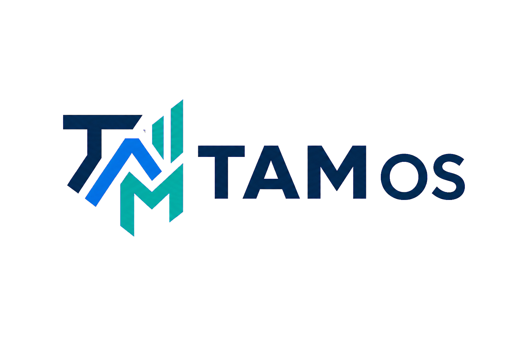
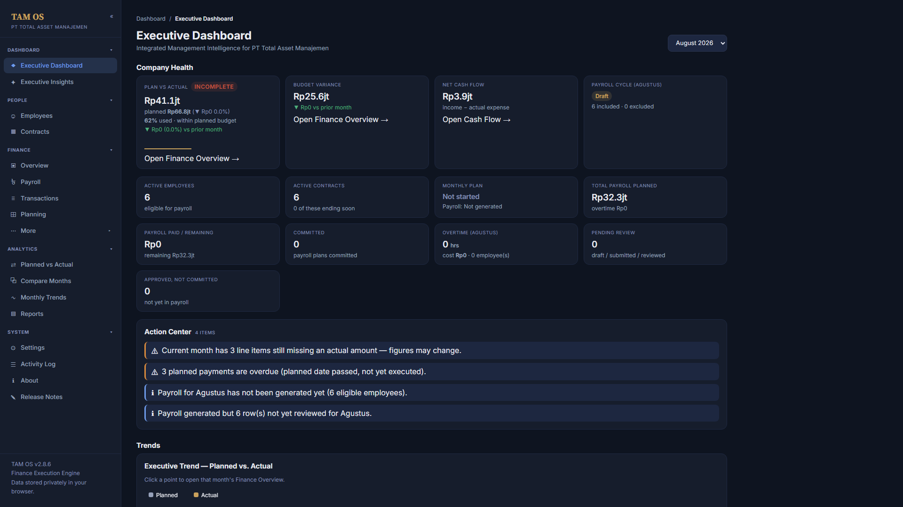
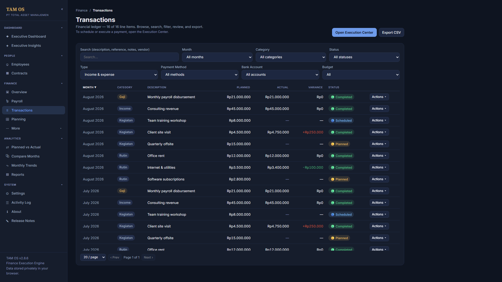
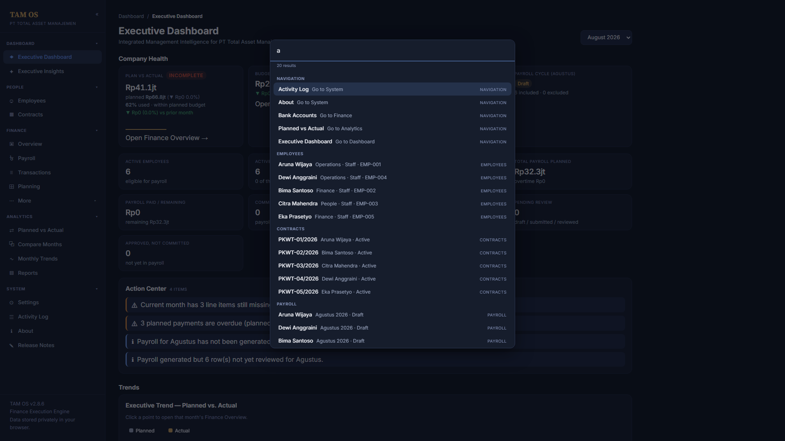
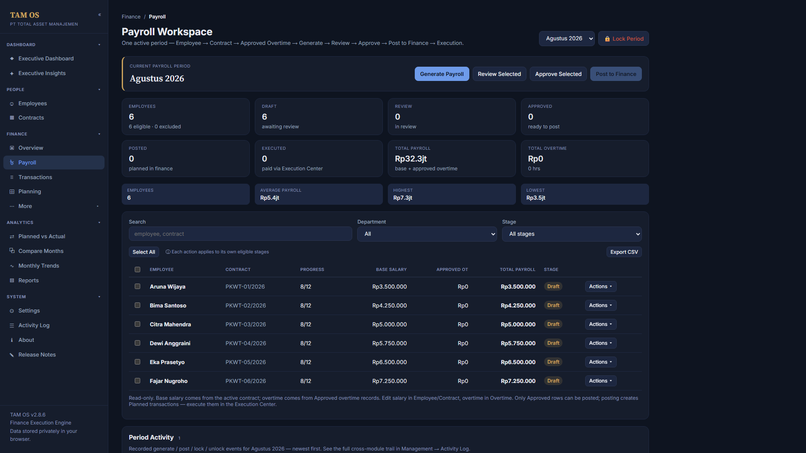
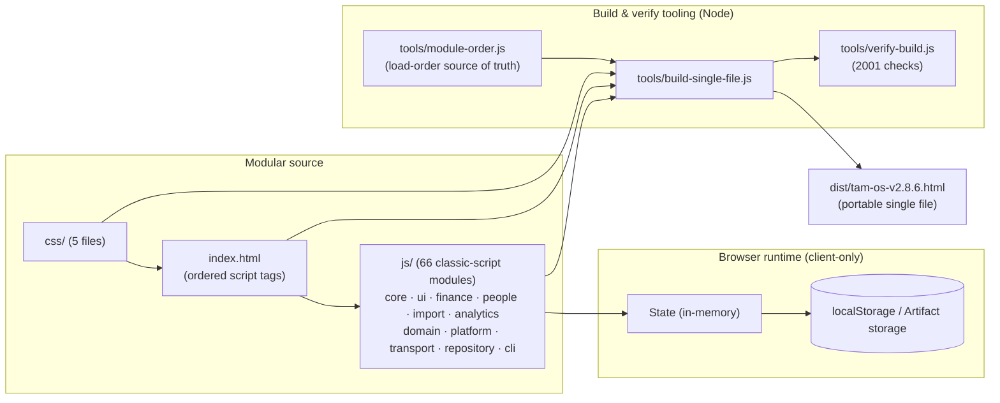
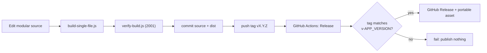

<div align="center">



# TAM OS

**Integrated Management Intelligence for PT Total Asset Manajemen** — a single-page finance,
payroll, and operations workspace. It runs entirely in the browser today and is architected to
support backend capabilities in future roadmap phases.

</div>

[](https://github.com/fanoryu/TAM-OS/actions/workflows/ci.yml)
[](https://github.com/fanoryu/TAM-OS/releases/latest)


> **Public source repository — company data is separate.** This is the **public source core** of TAM
> Intelligence OS: application source, tooling, docs, and an empty-data default. Production company data
> and configuration are **maintained separately** in a private company layer (see
> [`docs/DEPLOYMENT.md`](docs/DEPLOYMENT.md)); the application ships **no** company data and requires
> none to run. **Licensing:** the current [`LICENSE`](LICENSE) is proprietary — reuse, redistribution,
> or modification rights are **not** granted, and this repository is **not** (yet) declared open source.
> Do **not** commit real company, employee, payroll, or backup data.

---

## Overview

TAM OS is an internal operations tool for **PT Total Asset Manajemen**. It manages the
monthly cycle for finance and people operations — employees and contracts, overtime, payroll
generation and posting, transaction execution, cash flow, budgeting, and reporting — as one
self-contained HTML application.

Design principles:

- **Client-side today.** All data is currently stored locally in the browser's `localStorage` (or the
  Claude Artifact storage environment); the shipped application sends nothing to a server. Backend
  capabilities are a **future roadmap direction** and are introduced only under a separate, explicitly
  approved architecture decision — the current release remains client-only.
- **No build framework, no dependencies.** The app is plain HTML, CSS, and classic-script JavaScript
  sharing one global scope. Node.js is used **only** for the build/verify tooling, never to run the
  app. The only external network references are the XLSX parser and web fonts (CDN).
- **Two shippable forms.** A modular development source and a single portable HTML file that behaves
  identically.
- **Data-safety first.** A 2001-check verifier guards the persisted-data schema, storage keys,
  migration flags, and build fidelity on every change.

---

## Product Preview

Captured from the frozen UX-005 interface (dark theme) using clearly-labelled fabricated demo data.

### Executive Overview
The Executive Dashboard — Company Health KPIs, the navigation-only Action Center, and executive trends.



### Financial Operations
The Transactions ledger on the shared Data Grid — search, filters, sortable columns, planned vs. actual with variance, status pills, pagination, and CSV export.



### Global Search
The `Ctrl/Cmd+K` command palette — navigation-only results grouped across Navigation, Employees, Contracts, and Payroll.



### Payroll Workspace
The operational payroll worksheet — period KPIs and the Draft → Review → Approve → Post → Execute lifecycle over a read-only worksheet.



---

## Current release

**v2.8.6 — Navigation Experience & TAM OS Rebrand** · `SCHEMA_VERSION` 6 · **published, marked Latest**

> **Release state.** v2.8.6 is **published and marked Latest**, from annotated tag `v2.8.6` on commit
> `7ac0092d`. Its published asset `tam-os-v2.8.6.html` (998,413 bytes, SHA-256
> `8481523c11f78c8959291912551ee3205781daf0ec466ff79cfc59c7c91d3f62`) is byte-identical to the repository
> artifact and is the first release under the TAM OS naming convention. **v2.8.5 remains published**
> (annotated tag `v2.8.5` at commit `96a8d17`, asset `tam-intelligence-os-v2.8.5.html`, 965,767 bytes,
> immutable) and is simply no longer the Latest release; **v2.8.4 — Monthly Plan Result Integrity** also
> remains published and unchanged. See [`docs/RELEASE-PROCESS.md`](docs/RELEASE-PROCESS.md) for how a
> release is cut.

A navigation, presentation and naming release, packaging the complete UX-004 navigation modernization
(UX-004B–UX-004F), the sidebar interaction hotfix, and the TAM OS rebrand. No business-logic or schema
change, no new or renamed storage key, no data migration, and **no change to how or when data is
written**. Starting with v2.8.6 the portable artifact uses the TAM OS naming `dist/tam-os-v2.8.6.html`.

- **The application shell is built once and stays mounted** — switching views replaces only the view
  content, so the sidebar and navigation keep their identity instead of being rebuilt on every
  navigation.
- **Refreshed UI chrome** — a sans-serif UI typeface with shared spacing, radius and type token scales.
  Chart colours now come from the theme tokens, and the light-theme chart colours were corrected.
- **A calmer Executive Dashboard** — reduced from 20 metric containers to 13, with the alert list capped
  while every alert remains reachable.
- **Contract timeline figures use one coherent reference date** — today-facing results are unchanged;
  results advised for a historical date are now correct.
- **Contract state and contract expiry are two separate derived facts** — a contract can be Active and
  at the same time be flagged as ending today, this week, this month or next month. Scheduled is derived
  from the dates and is never stored, and the calendar horizons do not depend on the warning-days
  setting.
- **Contract progress wording is fixed** — on a three-month contract, month 1 reads `1/3` with 2 months
  remaining, month 2 reads `2/3` with 1 month remaining, and month 3 reads `3/3` as the final month with
  0 months remaining. **`3/3` no longer implies a month is still left**; the month after the end reads
  Expired.
- **Every contract counter resolves through one shared helper** — the dashboard counts, the status
  filters and the badges agree. Active includes active contracts that are ending soon, and excludes
  Scheduled and Expired. Wording follows a fixed priority: Ends Today → Ends This Week → Final Month →
  Ends Next Month → Ending Soon, and the exported CSV Status column uses the same words.

**What this release does not do.** **UX-001 was discovery only** — its direction is recorded, not
shipped. The redesigned sidebar and navigation (**UX-004**), breadcrumbs and quick actions, the
collapsed / pinned / hover-expand rail, and the mobile drawer (**UX-005**) are **not included** and
remain future work. **OQ-2 and OQ-3 remain OPEN**; no contract editor authority migration and no
deletion-command migration occurred. Payroll and committed-payroll semantics are unchanged, and existing
backups remain compatible.

Builds on the **v2.8.4 Monthly Plan Result Integrity** release. See [`CHANGELOG.md`](CHANGELOG.md)
and [`RELEASE_NOTES.md`](RELEASE_NOTES.md) for full history.

Two supported outputs:

| Output | What it is | Where |
|---|---|---|
| **A. Modular development source** | `index.html` + `css/` (5 files) + `js/` (66 classic-script modules across `core/ ui/ finance/ people/ import/ analytics/ domain/ platform/ transport/ repository/ cli/` — 65 browser-loaded in one shared global scope, plus the CLI-only module), no ES modules | project root |
| **B. Portable single-file release** | one self-contained HTML file, identical in behavior | `dist/tam-os-v2.8.6.html` |

---

## Product capabilities

- **Finance operations** — a transaction ledger with planned vs. actual amounts, an Execution
  Center to execute/schedule/cancel payments, cash-flow and budget views, and a financial calendar.
- **People & payroll** — employees and contracts with work schedules; an operational Payroll
  Workspace running Draft → Review → Approved → Posted → Executed over a read-only worksheet; a
  TAM-method overtime engine that feeds approved overtime into payroll; and **Supplemental Payments**
  that settle overtime approved after payroll is immutable.
- **Payroll integrity & history** — Posted/Executed payroll renders from **immutable committed
  snapshots** through a single source-of-truth helper (`payrollHistoricalSnapshot()`), with an
  at-a-glance integrity indicator and deterministic integrity checks; committed financial history is
  never reconstructed or auto-repaired.
- **Planning & analytics** — a monthly plan generator, planned-vs-actual and month-over-month
  comparisons, trend charts, and an executive dashboard.
- **Data import** — Smart Import extracts employees/contracts/transactions from spreadsheets with
  column mapping, conflict handling, and duplicate prevention.
- **Governance & recovery** — a read-only cross-module Activity Log (audit trail), Complete Backup /
  Restore, CSV exports, and typed-confirmation safeguards around destructive actions.

---

## Feature matrix

Status legend: **Available** = shipped and in use · **Partial** = usable with documented limits ·
**Planned** = on the roadmap, not yet available.

| Module / capability | Status | Notes |
|---|---|---|
| Executive Dashboard | Available | KPI overview, executive insights |
| Finance Overview | Available | Planned vs. actual, status rollups |
| Transactions | Available | Ledger with planned/actual, filters, CSV export |
| Execution Center | Available | Execute / schedule / cancel payments |
| Cash Flow | Available | Inflow/outflow by period |
| Budget Center | Available | Budget vs. actual tracking |
| Employees | Available | Records, work schedules, search/filters; bank from Bank Master, masked account |
| Bank Accounts (Company) | Available | Settings → Bank Accounts: CRUD, purpose/status, masked numbers |
| Indonesian Bank Master | Available | Reusable grouped bank reference (constant, single source) |
| Employee Detail | Available | Profile + contract, payroll & overtime timeline; supplemental-aware Payroll History with Total Compensation |
| Contracts | Available | Contract lifecycle, coverage per month |
| Payroll Workspace | Available | Draft → Review → Approved → Posted → Executed; generic bulk selection |
| Payroll Detail | Available | Read-only payroll + generated finance transaction; integrity indicator |
| Historical Payroll Snapshot | Available | Posted/Executed render immutable committed snapshots via `payrollHistoricalSnapshot()` |
| Payroll Integrity | Available | Compact 🟢/🟡 indicator, mismatch notice, deterministic integrity checks (detect-only) |
| Overtime | Available | TAM-method calculation, approval, drift warnings |
| Monthly Plan Generator | Available | Builds the monthly plan from master data |
| Smart Import | Available | Spreadsheet import, column mapping, dedup |
| Activity Log | Available | Read-only cross-module audit trail |
| Reports | Available | Report views and CSV export |
| Company Settings | Available | Company profile, schedules, appearance |
| Backup & Restore | Available | Complete Backup JSON export/import |
| CSV Export | Available | Payroll, overtime, transactions, reports |
| Search & Filters | Available | Incremental, focus-preserving across modules |
| Theme support | Available | Light/dark, pre-paint theme reconciliation |
| Supplemental Payments | Available | Settle overtime approved after payroll is immutable; Draft→…→Executed; global duplicate prevention |

This matrix lists shipped functionality only; it does not promise unavailable features.

---

## Screenshots

Product screenshots are captured to a fixed, safe standard: **1920×1080**, **dark theme**, **sidebar
expanded**, using **clearly fabricated demo data only** (never real company, employee, payroll, or
backup data). Target views are the Executive Dashboard (Company Health + Action Center), Finance
Overview, and the Transactions data grid (sorting + pagination). Sanitized captures are committed under
`docs/screenshots/` and embedded here.

> **Status (MAINT-001):** the branding assets and capture standard are in place; the high-resolution
> screenshot files are added in a follow-up capture pass performed in an environment with pixel export
> (this sprint's environment can render the UI but cannot export 1920×1080 image files). No placeholder
> or low-resolution images are committed in the interim. Until they land, run the app locally (below)
> to explore the UI.

---

## Architecture overview



The 65 browser-loaded modules are **classic scripts** sharing one global scope; their **load order** is the single
critical invariant and lives once in `tools/module-order.js` (mirrored by `index.html`). The build
inlines CSS + JS into one portable file; the verifier asserts the dist equals the concatenated
source and that the version identity, schema, storage keys, and decomposition are all consistent.
Historical payroll rendering is centralized through a single stage-aware helper,
`payrollHistoricalSnapshot()`, so Posted/Executed figures and reports are deterministic and read
from immutable committed evidence rather than live master data. See
[`ARCHITECTURE.md`](ARCHITECTURE.md) for the full module map, provenance, and additional
diagrams (payroll workflow, release pipeline).

---

## Project structure

```
index.html                         Modular entry: meta, external deps, pre-paint theme
                                   script, ordered CSS <link> + JS <script> tags, mounts
css/                               Extracted styles (load order fixed)
  tokens.css base.css shell.css components.css charts.css
js/                                66 classic-script modules (65 browser-loaded, one shared
                                   global scope; cli/ is Node-only)
  core/       constants, utils, storage-adapter, state, state-load-migrations,
              domain-services, hr-persistence-portability, stabilization,
              onboarding-reset, app-bootstrap
  ui/         charts, shell-render, settings-about, activity-log
  finance/    dashboard, execution-center, transaction-modals, transactions,
              add-upload, cashflow, budget
  people/     people-core, employees, contracts, payroll-planning, recurring-expenses,
              monthly-plan, legacy-mapping, hr-dashboard-reports, overtime,
              employee-dedup, payroll-ops-engine, payroll-workspace, supplemental-engine
  import/     parser, import-preview, smart-import-extract, smart-import-commit,
              smart-import-ui
  analytics/  plan-vs-actual, compare, trends, executive-dashboard,
              executive-insights, reports
tools/
  module-order.js                  Single source of truth for JS load order
  app-version.js                   Single source of truth for the version (reads constants.js)
  build-single-file.js / .ps1      Modular source -> dist single file (version-derived filename)
  verify-build.js / .ps1           Build + invariant + focus-fix + decomposition + audit verification
dist/
  tam-os-v2.8.6.html  Portable single-file release (build output, version-controlled)
tam-intelligence-os-v2.5.2.html    Frozen stable reference (source of truth for invariants)
.github/                           Repository governance & delivery
  workflows/ci.yml                 Build + verify on push/PR to main; uploads dist artifact
  workflows/release.yml            Tag-triggered (v*) GitHub Release; publishes portable HTML
  ISSUE_TEMPLATE/                  bug_report.yml, feature_request.yml, config.yml
  pull_request_template.md  CODEOWNERS  RELEASE_TEMPLATE.md
docs/                              QA-CHECKLIST.md, RELEASE-PROCESS.md, DATA-SAFETY.md
LICENSE  PROPRIETARY-LICENSE-NOTICE.md  SECURITY.md  CONTRIBUTING.md  CODE_OF_CONDUCT.md
RELEASE_NOTES.md  README.md  ARCHITECTURE.md  CHANGELOG.md
.gitignore  .gitattributes
```

---

## Getting started

No framework and no `npm install` are required to run the app. Because the modular source loads
local `css/` and `js/` files, serve the folder over HTTP (recommended) rather than opening via
`file://`:

```bash
python -m http.server 8000
```

Then open <http://localhost:8000>. Any static server works (`npx serve`, VS Code Live Server). The
portable build in `dist/` — or the asset from the
[latest release](https://github.com/fanoryu/TAM-OS/releases/latest) — can also be
opened directly in a browser.

---

## Development workflow

1. **Confirm the baseline:** `git status` (clean), `git branch --show-current` (main),
   `git describe --tags --abbrev=0` (latest release tag).
2. **Edit the modular source** — never edit `dist/` by hand. If you add or move a module, update
   `tools/module-order.js` **and** `index.html` together.
3. **Build** the portable file, then **verify** (both below).
4. **Browser QA** in both the modular source and the portable dist — zero console errors.
5. Update [`CHANGELOG.md`](CHANGELOG.md) (and [`RELEASE_NOTES.md`](RELEASE_NOTES.md) for a release)
   and any affected docs; keep version references consistent (the version lives once, in
   `APP_VERSION`).
6. Commit the source **and** the rebuilt `dist/` together.

Branch naming: `feature/<name>`, `fix/<name>`, `chore/<name>`, `release/<version>`. See
[`CONTRIBUTING.md`](CONTRIBUTING.md) for the full contract.

---

## Build and verification

**Toolchain:** Node.js is the primary build/verify environment (tested on **v24**; any v18+ works).
It has no dependencies — plain `fs`/`path`, nothing to `npm install`. PowerShell scripts are an
optional fallback for machines without Node.

Build the portable single file from the modular source:

```bash
node tools/build-single-file.js
```

Verify (2001 checks):

```bash
node tools/verify-build.js
```

Optional PowerShell fallback:

```bash
powershell -ExecutionPolicy Bypass -File tools/build-single-file.ps1
powershell -ExecutionPolicy Bypass -File tools/verify-build.ps1
```

**Version is derived, never hardcoded.** The single source of truth is `const APP_VERSION` in
`js/core/constants.js`. `tools/app-version.js` parses it; the build and verify tools derive
everything from there — the output filename is `dist/tam-intelligence-os-v${APP_VERSION}.html`
automatically. The verifier fails the build if:

- CSS drifts from the v2.5.2 golden master (styles must stay byte-for-byte identical apart from the
  one v2.6.3b floating-menu rule);
- the dist inlined payload ≠ the concatenated modular source (build fidelity);
- the version identity (`APP_VERSION`, `<title>`, `APP_RELEASE_NAME`, the Release Notes entry, the
  dist filename) is inconsistent;
- a storage key changes, `SCHEMA_VERSION` changes (must stay 6), or a migration flag disappears;
- the seed data is non-empty, a mount point is missing, or ES `import`/`export`/`type="module"`
  appears;
- the search-focus fix, module decomposition, or the audit/timeline/blocker features regress.

---

## Release process

Releases are tag-driven and guarded end-to-end (see [`docs/RELEASE-PROCESS.md`](docs/RELEASE-PROCESS.md)):

1. Bump `APP_VERSION` + `APP_RELEASE_NAME` in `js/core/constants.js`; add a Release Notes entry.
2. Build + verify; boot modular and dist with zero console errors.
3. Commit source + rebuilt dist; annotate a `vX.Y.Z` tag; push `main` then the tag.
4. The **Release** workflow (`.github/workflows/release.yml`) rebuilds, verifies, **refuses to
   publish unless the tag equals `v<APP_VERSION>`** and the portable HTML exists, then creates or
   refreshes the GitHub Release idempotently and uploads the portable asset.



The **CI** workflow (`.github/workflows/ci.yml`) builds + verifies on every push/PR to `main` and
uploads the portable HTML as a build artifact.

---

## Data safety

TAM OS stores finance, payroll, employee, and contract data **locally**; data never
leaves the device on its own. The verifier enforces these invariants unless a change is an
**intentional, documented migration**:

- `SCHEMA_VERSION` = 6; the 15 storage keys and the migration flags are stable.
- The shipped build ships **empty seed data**.
- The Complete Backup JSON format is stable; destructive actions (Restore, Employee Merge, Smart
  Import, Start Fresh) snapshot data first.

Never commit real company/personal data. Full guidance: [`docs/DATA-SAFETY.md`](docs/DATA-SAFETY.md).

---

## Repository documentation

Each document owns one responsibility; they cross-reference rather than repeat one another.

| Document | Role | Read it for |
|---|---|---|
| [`README.md`](README.md) | Public overview | What the product is, how to run/build it, where everything lives (this file) |
| [`CLAUDE.md`](CLAUDE.md) | Engineering constitution | The timeless, version-agnostic rules for changing this codebase; the approval matrix and Definition of Done |
| [`AI_CONTEXT.md`](AI_CONTEXT.md) | Repository knowledge | The current state — modules, workflows, decisions, limitations, glossary — for fast onboarding |
| [`ARCHITECTURE.md`](ARCHITECTURE.md) | Technical implementation | The module map, load order, per-release provenance, and diagrams |
| [`CONTRIBUTING.md`](CONTRIBUTING.md) | Contribution workflow | The step-by-step contributor contract (baseline, build, verify, QA, RC, approvals) |
| [`SECURITY.md`](SECURITY.md) | Security policy | How to report vulnerabilities privately and the data-handling expectations |
| [`CHANGELOG.md`](CHANGELOG.md) | Historical changes | The full version-by-version history |
| [`RELEASE_NOTES.md`](RELEASE_NOTES.md) | Release summaries | The summary for the current release |

### `docs/` folder

The [`docs/`](docs/README.md) folder ([index](docs/README.md)) holds supporting documentation and
decision records; its governance model is [ADR-0001](docs/adr/ADR-0001-documentation-governance-model.md).

| Document | Role | Read it for |
|---|---|---|
| [`docs/QA-CHECKLIST.md`](docs/QA-CHECKLIST.md) | Process | The QA checklist run before a change is done |
| [`docs/RELEASE-PROCESS.md`](docs/RELEASE-PROCESS.md) | Process | The step-by-step release procedure |
| [`docs/DATA-SAFETY.md`](docs/DATA-SAFETY.md) | Reference | Data-safety guidance for storage, migrations, backups |
| [`docs/DEPLOYMENT.md`](docs/DEPLOYMENT.md) | Runbook | How the build is deployed; public/private layering |
| [`docs/adr/`](docs/adr/README.md) | Decision records | Architecture Decision Records (ADR-NNNN) |
| [`docs/security/`](docs/security/README.md) | Decision records | Security Decision Records (SDR-NNNN) |
| [`docs/RDR/`](docs/RDR/README.md) | Decision records | Repository Decision Records (RDR-NNN) — repository state snapshots |

Supporting documents: [`CODE_OF_CONDUCT.md`](CODE_OF_CONDUCT.md) (collaborator conduct),
[`LICENSE`](LICENSE) / [`PROPRIETARY-LICENSE-NOTICE.md`](PROPRIETARY-LICENSE-NOTICE.md) (proprietary terms).

New to the repository? Start with **AI_CONTEXT.md** for context, then **CLAUDE.md** before making
changes. Browsing `docs/`? Start at the [`docs/` index](docs/README.md).

---

## Roadmap

Directions only — no release numbers are assigned unless already approved.

**Workspace refresh (UX workstream)**

Complete, merged to `main`, and shipped in **v2.8.5** (see [`AI_CONTEXT.md`](AI_CONTEXT.md) for detail):

- ✅ **UX-001** — Minimal Workspace Discovery. Discovery and product direction only: a minimal
  enterprise workspace, less "AI dashboard" presentation, typography and density over decorative
  redesign, sidebar/navigation deferred. It authorized no implementation by itself.
- ✅ **UX-002A** — Persistent Shell/View Foundation. The shell mounts once; navigation replaces view
  content without rebuilding it.
- ✅ **UX-002B** — Visual Foundation and Dashboard Density. Sans UI chrome, spacing/radius/type tokens,
  digest-pinned CSS golden master, theme-token chart colours, Executive Dashboard density pass.
- ✅ **UX-003A** — Reference-Date Correctness. `daysUntilEnd` shares one reference basis with the rest
  of `contractCalc`.
- ✅ **UX-003B** — Canonical Contract Timeline Model. Effective state and expiry horizon become two
  independent derived dimensions.
- ✅ **UX-003C** — Contract Progress, Counters, Filters and Presentation. One canonical counter,
  canonical-state filters, lifecycle progress wording.

> **Why a documentation milestone?** Documentation Reconciliation updates project documentation
> only and introduces no production-code changes. It exists so the living documents match what
> the repository actually contains after a run of implementation sprints.

Milestone status:

- ✅ **Documentation Reconciliation** — living documents reconciled with the repository state.
- ✅ **v2.8.5 Published** — annotated tag `v2.8.5`, published GitHub Release, asset verified.

Delivered since v2.8.6 (merged to `main`; see [`AI_CONTEXT.md`](AI_CONTEXT.md)):

- ✅ **UX-004** — Sidebar & Navigation (domain-grouped sidebar, context-aware navigation, breadcrumbs,
  quick actions, collapsed rail, pinned mode, hover-expand, responsive drawer).
- ✅ **UX-005A** — Executive Dashboard & Information Architecture (canonical home, Action Center,
  KPI drill-through; Finance Overview recast as the operational finance workspace).
- ✅ **UX-005B** — Data Grid Foundation (`js/core/data-grid.js`: reusable column definitions, comparator
  registry, single-column sort, pagination 20/50/100, debounced search, result count, filtered-empty
  states, declarative feature flags), adopted by Transactions and Employees.
- ✅ **UX-005C** — Design System Consistency (canonical section rhythm; eliminated off-grid spacing drift;
  numeric-typography standard; nav glyph disambiguation), tokens frozen.
- ✅ **UX-005D** — Global Search (`Ctrl/Cmd+K` command palette over a pure, source-agnostic engine;
  navigation-only activation; Navigation/Employee/Contract/Payroll result types; transaction entity search
  deferred).
- ✅ **UX-005E** — Responsive & Density Polish (shared `.modal` viewport containment `max-height:88vh;
  overflow-y:auto`; no density preference; table density and breakpoints frozen).
- ✅ **UX-005F** — Final Workspace Polish & Accessibility Hardening (skip-to-content + `<main>` landmark;
  modal Tab focus containment; finance dialog semantics; decorative-glyph hiding; focus-visible coverage;
  Data Grid `aria-sort` on `<th>`).
- ✅ **UX-005 Platform Freeze Review** — UX-005A–F verified coherent and stable; platform frozen as the
  basis for v2.9.0.

Next, in order:

1. **MAINT-001** — Repository maintenance & branding refresh (legacy-script removal, documentation
   synchronization, official branding adoption, README refresh). See
   [`docs/01-roadmap/MAINT-001-repository-maintenance.md`](docs/01-roadmap/MAINT-001-repository-maintenance.md).
2. **v2.9.0 Release Preparation** — dedicated release-prep and controlled publication of the frozen
   UX-005 platform.
3. **UX-006** — Personal Workspace (employee self-service) with route/record authorization. See the
   [UX-005/UX-006 architecture freeze](docs/01-roadmap/UX-005-Executive-Personal-Workspace-Architecture.md).
   **Not started.**

**Released**
- Workspace & Contract Timeline Integrity — persistent application shell, sans UI chrome and token
  scales, Executive Dashboard reduced to 13 metric containers, reference-date-correct contract
  timeline, canonical two-dimensional timeline model, one canonical contract counter and corrected
  `3/3` final-month progress wording (v2.8.5)
- Monthly Plan Result Integrity — the commit inspects both save results, no false success, preview
  retained on failure, Critical Integrity Check finding for absent-plan and missing-backlink states;
  retry prevents duplicate transactions but does not reconcile linkage (v2.8.4)
- Payroll Posting Integrity — posting inspects all four save results, no false success audit or
  completion UX, no duplicate Finance transaction on retry, no guessed ambiguous match, two new
  Critical Integrity Check findings (v2.8.3)
- Honest Persistence Results — multi-dataset saves report failure instead of unconditional success;
  no false completion, audit, or navigation after a failed write (v2.8.2)
- Single Payroll Posting Authority — legacy Payroll Planning retired, one canonical committed-state
  predicate, contract-cancellation warning restored (v2.8.1)
- Aggregate-Owned Contract Renewal — `ContractRenewalAggregate`, checked Repository persistence,
  in-memory rollback, no false-success UI (v2.8.1)
- Supplemental-Aware Payroll History — `payrollTotalCompensation()` read-model, Total Compensation
  reporting, pending/committed distinction (v2.7.3)
- Persistence & Transactional Integrity — strict persistence results, atomic supplemental posting,
  transaction-safe restore, checked execution, orphan recovery (v2.7.2)
- Payroll Integrity & Reporting Foundation — historical source-of-truth model, immutable committed
  snapshots, payroll integrity framework (v2.7.1)
- Supplemental Payroll Engine — settle overtime after payroll is immutable (v2.7.0)
- Enterprise Banking Foundation — Bank Master, Company Bank Accounts, employee banking (v2.6.9)
- Payroll operational workspace with generic bulk selection (v2.6.8)
- Immediate overtime-drift visibility (v2.6.8)
- Read-only Activity Log and payroll audit timeline (v2.6.4)

**Planned**
- **Payroll Reporting suite** — consolidated payroll/supplemental reporting and exports built on the
  v2.7.1 historical source-of-truth model (deliberately deferred until that model is validated in
  production).
- **Supplemental sources beyond overtime** — bonuses/reimbursements/adjustments (the engine is
  designed to extend; only overtime settlement ships today).
- **Repository maintenance** — ongoing tooling, documentation, and workflow upkeep.

**Under consideration**
- Authentication and role-based access control (RBAC)
- Attachment and evidence handling
- Expanded approval workflows

These are candidate directions, not commitments.

---

## Governance

- **Ownership & review:** [`.github/CODEOWNERS`](.github/CODEOWNERS) routes review to the repository
  owner across all paths.
- **Contributions:** [`CONTRIBUTING.md`](CONTRIBUTING.md) is the contract; PRs use
  [`.github/pull_request_template.md`](.github/pull_request_template.md) with data-safety and
  regression checkboxes.
- **Issues:** structured [bug](.github/ISSUE_TEMPLATE/bug_report.yml) and
  [feature](.github/ISSUE_TEMPLATE/feature_request.yml) forms; blank issues are disabled and
  security reports are routed privately.
- **Conduct:** [`CODE_OF_CONDUCT.md`](CODE_OF_CONDUCT.md).
- **CI/Release:** official GitHub Actions only; minimal permissions; tag/version guardrails.

---

## Branding

Official TAM OS brand assets live in [`assets/branding/`](assets/branding/). The **canonical**
reference is [`assets/branding/TAM-OS-Brand-Guidelines.pdf`](assets/branding/TAM-OS-Brand-Guidelines.pdf),
summarized for engineers in [`assets/branding/BRAND_GUIDELINES.md`](assets/branding/BRAND_GUIDELINES.md).

- **Primary wordmark:** `tam-os-logo-full-color.png` (light backgrounds) — the default signature.
- **Secondary monogram:** `tam-os-logo-secondary.png` (favicon, app icon, avatar, compact nav).
- **On-dark variants:** `tam-os-logo-dark-navy.png` (navy) · `tam-os-logo-black-background.png` (black).
- **Core colors:** TAM Navy `#062E5B` · TAM Blue `#1478F2` · TAM Teal `#08B9B0` · Ink `#102A43` ·
  Cloud `#F4F8FC`. Typeface: **Inter** (Arial fallback).

Use the supplied artwork only — never recolor, rebuild, stretch, rotate, or substitute the logo.

---

## License and security

- **License:** the current [`LICENSE`](LICENSE) is **proprietary** — all rights reserved by PT Total
  Asset Manajemen; reuse, redistribution, and modification are **not** granted and this repository is
  **not** declared open source (see also [`PROPRIETARY-LICENSE-NOTICE.md`](PROPRIETARY-LICENSE-NOTICE.md)).
  A future licensing decision may relax this; until then, treat the source as source-visible only.
- **Public core vs. private data:** this repository is the public source core and holds **no** company
  data; production data and configuration are maintained separately (see
  [`docs/DEPLOYMENT.md`](docs/DEPLOYMENT.md)).
- **Security:** report vulnerabilities privately via GitHub Security Advisories — never in a public
  issue, and never with real data. See [`SECURITY.md`](SECURITY.md).

© PT Total Asset Manajemen. All rights reserved.
