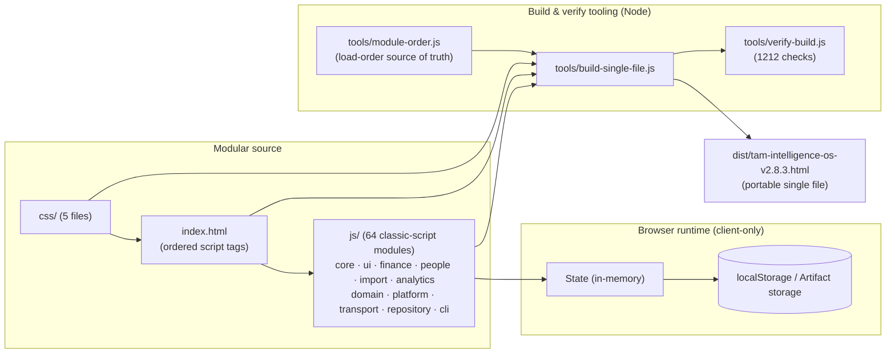
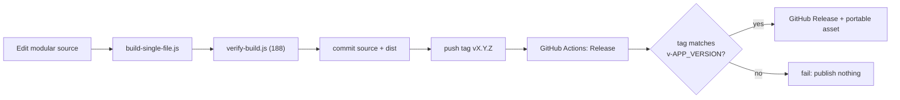

# TAM Intelligence OS

**Integrated Management Intelligence for PT Total Asset Manajemen** — a single-page finance,
payroll, and operations workspace that runs entirely in the browser, with no backend and no runtime
dependencies.

[](https://github.com/fanoryu/TAM-Intelligence-OS/actions/workflows/ci.yml)
[](https://github.com/fanoryu/TAM-Intelligence-OS/releases/latest)


> **Public source repository — company data is separate.** This is the **public source core** of TAM
> Intelligence OS: application source, tooling, docs, and an empty-data default. Production company data
> and configuration are **maintained separately** in a private company layer (see
> [`docs/DEPLOYMENT.md`](docs/DEPLOYMENT.md)); the application ships **no** company data and requires
> none to run. **Licensing:** the current [`LICENSE`](LICENSE) is proprietary — reuse, redistribution,
> or modification rights are **not** granted, and this repository is **not** (yet) declared open source.
> Do **not** commit real company, employee, payroll, or backup data.

---

## Overview

TAM Intelligence OS is an internal operations tool for **PT Total Asset Manajemen**. It manages the
monthly cycle for finance and people operations — employees and contracts, overtime, payroll
generation and posting, transaction execution, cash flow, budgeting, and reporting — as one
self-contained HTML application.

Design principles:

- **Client-side only.** All data is stored locally in the browser's `localStorage` (or the Claude
  Artifact storage environment). Nothing is sent to a server; there is no backend, database, or API.
- **No build framework, no dependencies.** The app is plain HTML, CSS, and classic-script JavaScript
  sharing one global scope. Node.js is used **only** for the build/verify tooling, never to run the
  app. The only external network references are the XLSX parser and web fonts (CDN).
- **Two shippable forms.** A modular development source and a single portable HTML file that behaves
  identically.
- **Data-safety first.** A 188-check verifier guards the persisted-data schema, storage keys,
  migration flags, and build fidelity on every change.

---

## Current release

**v2.8.3 — Payroll Posting Integrity** · `SCHEMA_VERSION` 6

A correctness release for posting payroll. Posting previously ignored whether its writes actually
succeeded, so a failed posting could still report success, and two failure modes could quietly cost or
double real money. Posting now checks every write, reports failure honestly, and refuses to guess. No
schema change, no new storage key, no data migration, and **no change to how or when data is written**.

- **Posting checks all four of its saves** — posting writes payroll plans, the monthly plan, overtime,
  and finance transactions. It previously discarded those results; it now reports success only when all
  four succeeded, and names the step that failed.
- **A failed posting no longer records a success audit entry** — the audit trail reflects what actually
  happened.
- **A failed posting no longer shows success behavior** — no completion toast and no posted summary
  when the posting did not complete.
- **Your selected Payroll rows stay visible after a failed posting** — the selection is no longer
  cleared, so you can see exactly which rows were involved while you review them.
- **Retrying after the orphan-transaction failure reuses the existing Finance transaction** — it no
  longer creates a second one. Previously, if the payroll-plan write failed after the transaction write
  succeeded, a reload left a real transaction that the retry could not see, and retrying **doubled the
  payroll amount**. Posting now finds that transaction, restores its link, and records a history entry.
- **Integrity Check reports orphan Payroll transactions as Critical** — a Finance transaction left
  behind by a partial posting is now surfaced instead of going unnoticed.
- **Integrity Check reports committed Payroll whose linked Overtime is still Approved as Critical** —
  previously, if the overtime write failed after the payroll and transaction writes landed, that
  overtime stayed Approved and could be **paid again in the next month's payroll**, with nothing
  detecting it.
- **Ambiguous Finance matches are never guessed** — if more than one transaction could be the match,
  posting skips that row uncommitted and tells you which candidates it found, rather than picking one
  or adding a third transaction.

**What this release does not do.** Posting **still writes four storage keys one after another, and it
is not atomic.** No rollback and no compensating action were introduced. A failure message therefore
means *the posting did not complete* — not *nothing was written*; earlier writes in the sequence may
well have persisted, and reloading reloads whatever was successfully persisted.

**Integrity Check detects; it does not repair.** The two new findings tell you a partial state exists
and where it is — they do not fix it, and **not every possible partial posting state is automatically
repairable.** After a failed posting, run Settings → Run Integrity Check, and expect that manual review
— or restoration from the pre-operation backup — may still be required.

Builds on the **v2.8.2 Honest Persistence Results** release. See [`CHANGELOG.md`](CHANGELOG.md)
and [`RELEASE_NOTES.md`](RELEASE_NOTES.md) for full history.

Two supported outputs:

| Output | What it is | Where |
|---|---|---|
| **A. Modular development source** | `index.html` + `css/` (5 files) + `js/` (64 classic-script modules across `core/ ui/ finance/ people/ import/ analytics/ domain/ platform/ transport/ repository/ cli/`), one shared global scope, no ES modules | project root |
| **B. Portable single-file release** | one self-contained HTML file, identical in behavior | `dist/tam-intelligence-os-v2.8.3.html` |

---

## Product capabilities

- **Finance operations** — a transaction ledger with planned vs. actual amounts, an Execution
  Center to execute/schedule/cancel payments, cash-flow and budget views, and a financial calendar.
- **People & payroll** — employees and contracts with work schedules; an operational Payroll
  Workspace running Draft → Review → Approved → Posted → Executed over a read-only worksheet; a
  TAM-method overtime engine that feeds approved overtime into payroll; and **Supplemental Payments**
  that settle overtime approved after payroll is immutable.
- **Payroll integrity & history** — Posted/Executed payroll renders from **immutable committed
  snapshots** through a single source-of-truth helper (`payrollHistoricalSnapshot()`), with an
  at-a-glance integrity indicator and deterministic integrity checks; committed financial history is
  never reconstructed or auto-repaired.
- **Planning & analytics** — a monthly plan generator, planned-vs-actual and month-over-month
  comparisons, trend charts, and an executive dashboard.
- **Data import** — Smart Import extracts employees/contracts/transactions from spreadsheets with
  column mapping, conflict handling, and duplicate prevention.
- **Governance & recovery** — a read-only cross-module Activity Log (audit trail), Complete Backup /
  Restore, CSV exports, and typed-confirmation safeguards around destructive actions.

---

## Feature matrix

Status legend: **Available** = shipped and in use · **Partial** = usable with documented limits ·
**Planned** = on the roadmap, not yet available.

| Module / capability | Status | Notes |
|---|---|---|
| Executive Dashboard | Available | KPI overview, executive insights |
| Finance Overview | Available | Planned vs. actual, status rollups |
| Transactions | Available | Ledger with planned/actual, filters, CSV export |
| Execution Center | Available | Execute / schedule / cancel payments |
| Cash Flow | Available | Inflow/outflow by period |
| Budget Center | Available | Budget vs. actual tracking |
| Employees | Available | Records, work schedules, search/filters; bank from Bank Master, masked account |
| Bank Accounts (Company) | Available | Settings → Bank Accounts: CRUD, purpose/status, masked numbers |
| Indonesian Bank Master | Available | Reusable grouped bank reference (constant, single source) |
| Employee Detail | Available | Profile + contract, payroll & overtime timeline; supplemental-aware Payroll History with Total Compensation |
| Contracts | Available | Contract lifecycle, coverage per month |
| Payroll Workspace | Available | Draft → Review → Approved → Posted → Executed; generic bulk selection |
| Payroll Detail | Available | Read-only payroll + generated finance transaction; integrity indicator |
| Historical Payroll Snapshot | Available | Posted/Executed render immutable committed snapshots via `payrollHistoricalSnapshot()` |
| Payroll Integrity | Available | Compact 🟢/🟡 indicator, mismatch notice, deterministic integrity checks (detect-only) |
| Overtime | Available | TAM-method calculation, approval, drift warnings |
| Monthly Plan Generator | Available | Builds the monthly plan from master data |
| Smart Import | Available | Spreadsheet import, column mapping, dedup |
| Activity Log | Available | Read-only cross-module audit trail |
| Reports | Available | Report views and CSV export |
| Company Settings | Available | Company profile, schedules, appearance |
| Backup & Restore | Available | Complete Backup JSON export/import |
| CSV Export | Available | Payroll, overtime, transactions, reports |
| Search & Filters | Available | Incremental, focus-preserving across modules |
| Theme support | Available | Light/dark, pre-paint theme reconciliation |
| Supplemental Payments | Available | Settle overtime approved after payroll is immutable; Draft→…→Executed; global duplicate prevention |

This matrix lists shipped functionality only; it does not promise unavailable features.

---

## Screenshots

No screenshots are committed yet (to avoid any risk of exposing real company data). A capture plan —
which screens to show, the required fabricated sample data, target filenames under `docs/images/`,
and recommended dimensions — is maintained by the maintainer and will be added here once
safe, sanitized captures exist. Until then, run the app locally (below) to explore the UI.

---

## Architecture overview



The 45 modules are **classic scripts** sharing one global scope; their **load order** is the single
critical invariant and lives once in `tools/module-order.js` (mirrored by `index.html`). The build
inlines CSS + JS into one portable file; the verifier asserts the dist equals the concatenated
source and that the version identity, schema, storage keys, and decomposition are all consistent.
Historical payroll rendering is centralized through a single stage-aware helper,
`payrollHistoricalSnapshot()`, so Posted/Executed figures and reports are deterministic and read
from immutable committed evidence rather than live master data. See
[`ARCHITECTURE.md`](ARCHITECTURE.md) for the full module map, provenance, and additional
diagrams (payroll workflow, release pipeline).

---

## Project structure

```
index.html                         Modular entry: meta, external deps, pre-paint theme
                                   script, ordered CSS <link> + JS <script> tags, mounts
css/                               Extracted styles (load order fixed)
  tokens.css base.css shell.css components.css charts.css
js/                                64 classic-script modules, one shared global scope
  core/       constants, utils, storage-adapter, state, state-load-migrations,
              domain-services, hr-persistence-portability, stabilization,
              onboarding-reset, app-bootstrap
  ui/         charts, shell-render, settings-about, activity-log
  finance/    dashboard, execution-center, transaction-modals, transactions,
              add-upload, cashflow, budget
  people/     people-core, employees, contracts, payroll-planning, recurring-expenses,
              monthly-plan, legacy-mapping, hr-dashboard-reports, overtime,
              employee-dedup, payroll-ops-engine, payroll-workspace, supplemental-engine
  import/     parser, import-preview, smart-import-extract, smart-import-commit,
              smart-import-ui
  analytics/  plan-vs-actual, compare, trends, executive-dashboard,
              executive-insights, reports
tools/
  module-order.js                  Single source of truth for JS load order
  app-version.js                   Single source of truth for the version (reads constants.js)
  decompose.js                     One-time feature-folder splitter (v2.6.2, byte-checked)
  extract-source.ps1               One-time deterministic splitter (v2.5.2 -> source, v2.6.0)
  build-single-file.js / .ps1      Modular source -> dist single file (version-derived filename)
  verify-build.js / .ps1           Build + invariant + focus-fix + decomposition + audit verification
dist/
  tam-intelligence-os-v2.8.3.html  Portable single-file release (build output, version-controlled)
tam-intelligence-os-v2.5.2.html    Frozen stable reference (source of truth for invariants)
.github/                           Repository governance & delivery
  workflows/ci.yml                 Build + verify on push/PR to main; uploads dist artifact
  workflows/release.yml            Tag-triggered (v*) GitHub Release; publishes portable HTML
  ISSUE_TEMPLATE/                  bug_report.yml, feature_request.yml, config.yml
  pull_request_template.md  CODEOWNERS  RELEASE_TEMPLATE.md
docs/                              QA-CHECKLIST.md, RELEASE-PROCESS.md, DATA-SAFETY.md
LICENSE  PROPRIETARY-LICENSE-NOTICE.md  SECURITY.md  CONTRIBUTING.md  CODE_OF_CONDUCT.md
RELEASE_NOTES.md  README.md  ARCHITECTURE.md  CHANGELOG.md
.gitignore  .gitattributes
```

---

## Getting started

No framework and no `npm install` are required to run the app. Because the modular source loads
local `css/` and `js/` files, serve the folder over HTTP (recommended) rather than opening via
`file://`:

```bash
python -m http.server 8000
```

Then open <http://localhost:8000>. Any static server works (`npx serve`, VS Code Live Server). The
portable build in `dist/` — or the asset from the
[latest release](https://github.com/fanoryu/TAM-Intelligence-OS/releases/latest) — can also be
opened directly in a browser.

---

## Development workflow

1. **Confirm the baseline:** `git status` (clean), `git branch --show-current` (main),
   `git describe --tags --abbrev=0` (latest release tag).
2. **Edit the modular source** — never edit `dist/` by hand. If you add or move a module, update
   `tools/module-order.js` **and** `index.html` together.
3. **Build** the portable file, then **verify** (both below).
4. **Browser QA** in both the modular source and the portable dist — zero console errors.
5. Update [`CHANGELOG.md`](CHANGELOG.md) (and [`RELEASE_NOTES.md`](RELEASE_NOTES.md) for a release)
   and any affected docs; keep version references consistent (the version lives once, in
   `APP_VERSION`).
6. Commit the source **and** the rebuilt `dist/` together.

Branch naming: `feature/<name>`, `fix/<name>`, `chore/<name>`, `release/<version>`. See
[`CONTRIBUTING.md`](CONTRIBUTING.md) for the full contract.

---

## Build and verification

**Toolchain:** Node.js is the primary build/verify environment (tested on **v24**; any v18+ works).
It has no dependencies — plain `fs`/`path`, nothing to `npm install`. PowerShell scripts are an
optional fallback for machines without Node.

Build the portable single file from the modular source:

```bash
node tools/build-single-file.js
```

Verify (188 checks):

```bash
node tools/verify-build.js
```

Optional PowerShell fallback:

```bash
powershell -ExecutionPolicy Bypass -File tools/build-single-file.ps1
powershell -ExecutionPolicy Bypass -File tools/verify-build.ps1
```

**Version is derived, never hardcoded.** The single source of truth is `const APP_VERSION` in
`js/core/constants.js`. `tools/app-version.js` parses it; the build and verify tools derive
everything from there — the output filename is `dist/tam-intelligence-os-v${APP_VERSION}.html`
automatically. The verifier fails the build if:

- CSS drifts from the v2.5.2 golden master (styles must stay byte-for-byte identical apart from the
  one v2.6.3b floating-menu rule);
- the dist inlined payload ≠ the concatenated modular source (build fidelity);
- the version identity (`APP_VERSION`, `<title>`, `APP_RELEASE_NAME`, the Release Notes entry, the
  dist filename) is inconsistent;
- a storage key changes, `SCHEMA_VERSION` changes (must stay 6), or a migration flag disappears;
- the seed data is non-empty, a mount point is missing, or ES `import`/`export`/`type="module"`
  appears;
- the search-focus fix, module decomposition, or the audit/timeline/blocker features regress.

---

## Release process

Releases are tag-driven and guarded end-to-end (see [`docs/RELEASE-PROCESS.md`](docs/RELEASE-PROCESS.md)):

1. Bump `APP_VERSION` + `APP_RELEASE_NAME` in `js/core/constants.js`; add a Release Notes entry.
2. Build + verify; boot modular and dist with zero console errors.
3. Commit source + rebuilt dist; annotate a `vX.Y.Z` tag; push `main` then the tag.
4. The **Release** workflow (`.github/workflows/release.yml`) rebuilds, verifies, **refuses to
   publish unless the tag equals `v<APP_VERSION>`** and the portable HTML exists, then creates or
   refreshes the GitHub Release idempotently and uploads the portable asset.



The **CI** workflow (`.github/workflows/ci.yml`) builds + verifies on every push/PR to `main` and
uploads the portable HTML as a build artifact.

---

## Data safety

TAM Intelligence OS stores finance, payroll, employee, and contract data **locally**; data never
leaves the device on its own. The verifier enforces these invariants unless a change is an
**intentional, documented migration**:

- `SCHEMA_VERSION` = 6; the 15 storage keys and the migration flags are stable.
- The shipped build ships **empty seed data**.
- The Complete Backup JSON format is stable; destructive actions (Restore, Employee Merge, Smart
  Import, Start Fresh) snapshot data first.

Never commit real company/personal data. Full guidance: [`docs/DATA-SAFETY.md`](docs/DATA-SAFETY.md).

---

## Repository documentation

Each document owns one responsibility; they cross-reference rather than repeat one another.

| Document | Role | Read it for |
|---|---|---|
| [`README.md`](README.md) | Public overview | What the product is, how to run/build it, where everything lives (this file) |
| [`CLAUDE.md`](CLAUDE.md) | Engineering constitution | The timeless, version-agnostic rules for changing this codebase; the approval matrix and Definition of Done |
| [`AI_CONTEXT.md`](AI_CONTEXT.md) | Repository knowledge | The current state — modules, workflows, decisions, limitations, glossary — for fast onboarding |
| [`ARCHITECTURE.md`](ARCHITECTURE.md) | Technical implementation | The module map, load order, per-release provenance, and diagrams |
| [`CONTRIBUTING.md`](CONTRIBUTING.md) | Contribution workflow | The step-by-step contributor contract (baseline, build, verify, QA, RC, approvals) |
| [`SECURITY.md`](SECURITY.md) | Security policy | How to report vulnerabilities privately and the data-handling expectations |
| [`CHANGELOG.md`](CHANGELOG.md) | Historical changes | The full version-by-version history |
| [`RELEASE_NOTES.md`](RELEASE_NOTES.md) | Release summaries | The summary for the current release |

### `docs/` folder

The [`docs/`](docs/README.md) folder ([index](docs/README.md)) holds supporting documentation and
decision records; its governance model is [ADR-0001](docs/adr/ADR-0001-documentation-governance-model.md).

| Document | Role | Read it for |
|---|---|---|
| [`docs/QA-CHECKLIST.md`](docs/QA-CHECKLIST.md) | Process | The QA checklist run before a change is done |
| [`docs/RELEASE-PROCESS.md`](docs/RELEASE-PROCESS.md) | Process | The step-by-step release procedure |
| [`docs/DATA-SAFETY.md`](docs/DATA-SAFETY.md) | Reference | Data-safety guidance for storage, migrations, backups |
| [`docs/DEPLOYMENT.md`](docs/DEPLOYMENT.md) | Runbook | How the build is deployed; public/private layering |
| [`docs/adr/`](docs/adr/README.md) | Decision records | Architecture Decision Records (ADR-NNNN) |
| [`docs/security/`](docs/security/README.md) | Decision records | Security Decision Records (SDR-NNNN) |
| [`docs/RDR/`](docs/RDR/README.md) | Decision records | Repository Decision Records (RDR-NNN) — repository state snapshots |

Supporting documents: [`CODE_OF_CONDUCT.md`](CODE_OF_CONDUCT.md) (collaborator conduct),
[`LICENSE`](LICENSE) / [`PROPRIETARY-LICENSE-NOTICE.md`](PROPRIETARY-LICENSE-NOTICE.md) (proprietary terms).

New to the repository? Start with **AI_CONTEXT.md** for context, then **CLAUDE.md** before making
changes. Browsing `docs/`? Start at the [`docs/` index](docs/README.md).

---

## Roadmap

Directions only — no release numbers are assigned unless already approved.

**Released**
- Payroll Posting Integrity — posting inspects all four save results, no false success audit or
  completion UX, no duplicate Finance transaction on retry, no guessed ambiguous match, two new
  Critical Integrity Check findings (v2.8.3)
- Honest Persistence Results — multi-dataset saves report failure instead of unconditional success;
  no false completion, audit, or navigation after a failed write (v2.8.2)
- Single Payroll Posting Authority — legacy Payroll Planning retired, one canonical committed-state
  predicate, contract-cancellation warning restored (v2.8.1)
- Aggregate-Owned Contract Renewal — `ContractRenewalAggregate`, checked Repository persistence,
  in-memory rollback, no false-success UI (v2.8.1)
- Supplemental-Aware Payroll History — `payrollTotalCompensation()` read-model, Total Compensation
  reporting, pending/committed distinction (v2.7.3)
- Persistence & Transactional Integrity — strict persistence results, atomic supplemental posting,
  transaction-safe restore, checked execution, orphan recovery (v2.7.2)
- Payroll Integrity & Reporting Foundation — historical source-of-truth model, immutable committed
  snapshots, payroll integrity framework (v2.7.1)
- Supplemental Payroll Engine — settle overtime after payroll is immutable (v2.7.0)
- Enterprise Banking Foundation — Bank Master, Company Bank Accounts, employee banking (v2.6.9)
- Payroll operational workspace with generic bulk selection (v2.6.8)
- Immediate overtime-drift visibility (v2.6.8)
- Read-only Activity Log and payroll audit timeline (v2.6.4)

**Planned**
- **Payroll Reporting suite** — consolidated payroll/supplemental reporting and exports built on the
  v2.7.1 historical source-of-truth model (deliberately deferred until that model is validated in
  production).
- **Supplemental sources beyond overtime** — bonuses/reimbursements/adjustments (the engine is
  designed to extend; only overtime settlement ships today).
- **Repository maintenance** — ongoing tooling, documentation, and workflow upkeep.

**Under consideration**
- Authentication and role-based access control (RBAC)
- Attachment and evidence handling
- Expanded approval workflows

These are candidate directions, not commitments.

---

## Governance

- **Ownership & review:** [`.github/CODEOWNERS`](.github/CODEOWNERS) routes review to the repository
  owner across all paths.
- **Contributions:** [`CONTRIBUTING.md`](CONTRIBUTING.md) is the contract; PRs use
  [`.github/pull_request_template.md`](.github/pull_request_template.md) with data-safety and
  regression checkboxes.
- **Issues:** structured [bug](.github/ISSUE_TEMPLATE/bug_report.yml) and
  [feature](.github/ISSUE_TEMPLATE/feature_request.yml) forms; blank issues are disabled and
  security reports are routed privately.
- **Conduct:** [`CODE_OF_CONDUCT.md`](CODE_OF_CONDUCT.md).
- **CI/Release:** official GitHub Actions only; minimal permissions; tag/version guardrails.

---

## License and security

- **License:** the current [`LICENSE`](LICENSE) is **proprietary** — all rights reserved by PT Total
  Asset Manajemen; reuse, redistribution, and modification are **not** granted and this repository is
  **not** declared open source (see also [`PROPRIETARY-LICENSE-NOTICE.md`](PROPRIETARY-LICENSE-NOTICE.md)).
  A future licensing decision may relax this; until then, treat the source as source-visible only.
- **Public core vs. private data:** this repository is the public source core and holds **no** company
  data; production data and configuration are maintained separately (see
  [`docs/DEPLOYMENT.md`](docs/DEPLOYMENT.md)).
- **Security:** report vulnerabilities privately via GitHub Security Advisories — never in a public
  issue, and never with real data. See [`SECURITY.md`](SECURITY.md).

© PT Total Asset Manajemen. All rights reserved.
